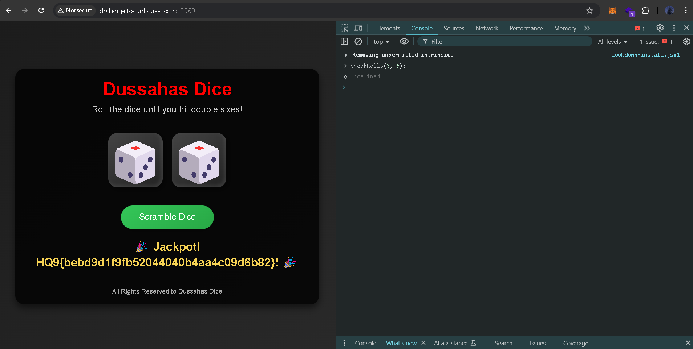
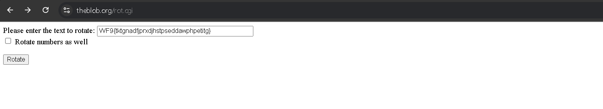
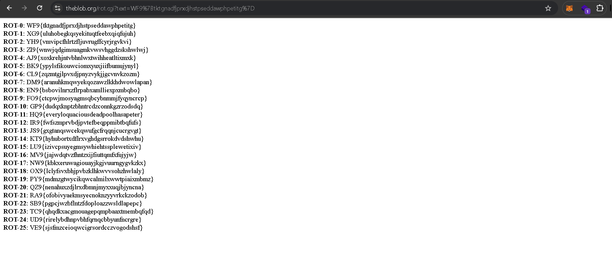
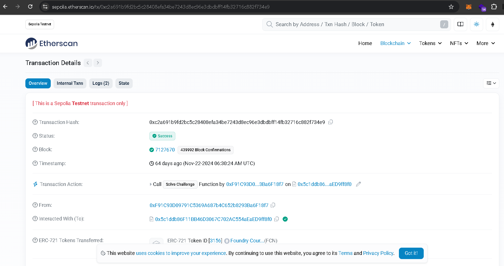
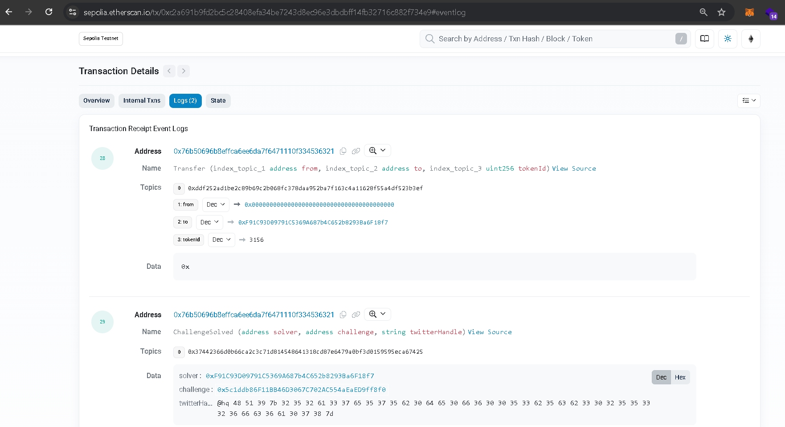
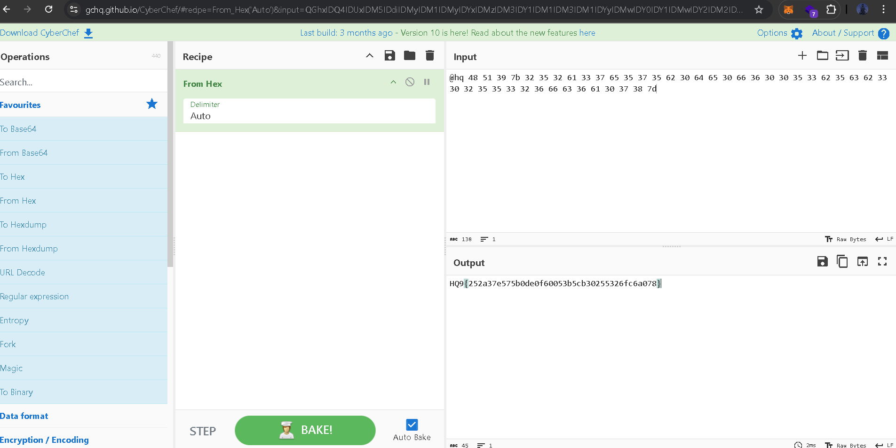

## 1. Breaking Bad

Writeup :

A ` message.txt `text file is given. 

```
Welcome to the "Breaking Bad" challenge! In this cryptographic puzzle, your mission is to decipher a secret message that has been cleverly encoded. The theme revolves around the idea of breaking down this chemical compound and uncovering hidden truths.

HQ9{1 89 19 50 39 103 5 9 74 16 59 6 19 114 23 1 1 5 83 15 23 33 6 19}
```

Decode  ` 1 89 19 50 39 103 5 9 74 16 59 6 19 114 23 1 1 5 83 15 23 33 6 19 ` using Periodic Table Decoder from <https://www.dcode.fr/atomic-number-substitution> .


And Get the hidden flag key.

## 2. Splatter The Bug

Writeup :

A link is given, which bring us to a webpage.
There was a `bug` appearing at random location at page when tried we tried to click on it, but can not able to click on it.

when the source code is viewed of the webpage using Developer tools, there was a lot of obfuscated code of javascript, which is very hard to de-obfuscated. but there was a hint at the normal javascript code which is a `ladybug.click()` function, commented and partially written.

So try to call `ladybug.click();` in console. And it will reveal the hidden flag key on the page.

## 3. Dussahas Dice

Writeup :

It is same as earlier `Splatter The Bug`, A site is given for rolling dice and with obfuscated javascript code, and a commented and partially written function `checkRolls(a,b)`.

So I tried to call the function `checkRolls(6,6)` in console and the site revealed the hidden flag key.



## 4. Codepool

Writeup :

A `QuestFile_Codepool.txt` text file is given.

```
WF9{tktgnadfjprxdjhstpseddawphpetitg}
```
The Challenge statement hints towards search `decode rot7` on google and after searching it on google, there is a site <https://theblob.org/rot.cgi> which decrypt the input text from rot0 to rot25.



So enter  the encrypted text `WF9{tktgnadfjprxdjhstpseddawphpetitg}` in the input section and it will present the out from rot0 to rot25 and at rot11, there is a familiar pattern of `HQ9{...}` which is of the hidden flag key and it was the hidden flag key.



## 5. Crypto Conundrum

Writeup :

A `QuestFile_CryptoConundrum` text file is given.

```
0xc2a691b9fd2bc5c28408efa34be7243d8ec96e3dbdbff14fb32716c882f734e9
```

As the Challenge statement and as the text format hints, the text is seems to be belonging to a transaction in sepolia testnetwork.

there is a site <https://sepolia.etherscan.io/> where all testnet transaction and other information regarding it can be seen and searched.

So visit the page and search for `0xc2a691b9fd2bc5c28408efa34be7243d8ec96e3dbdbff14fb32716c882f734e9` in search bar, and it present the transaction details,Go to the `Logs` tab and in `twitterHandle` value in `Data` the hidden flag key can be seen in hexadecimal form.





Decode it and get the hidden flag key .

