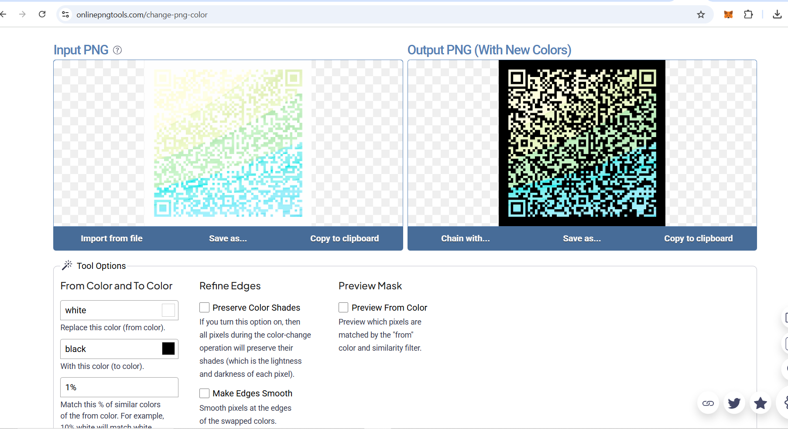
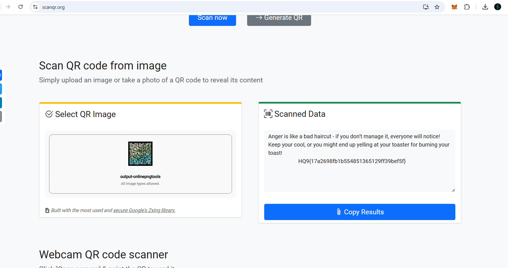
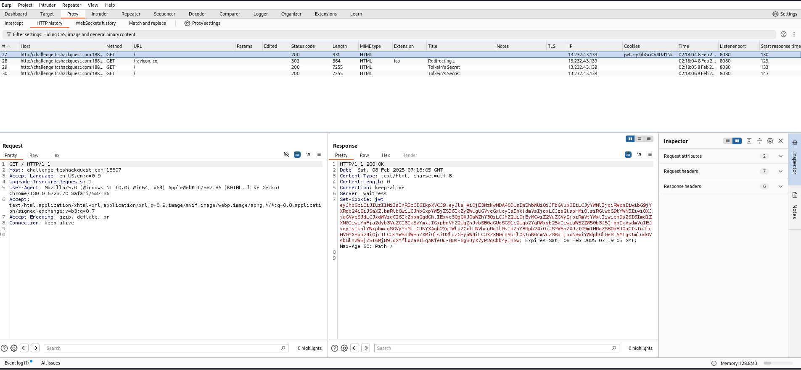
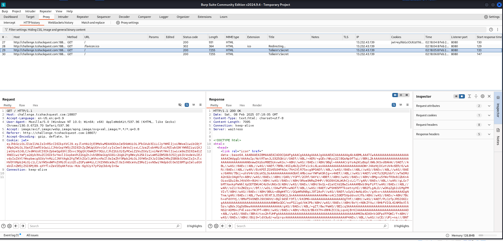
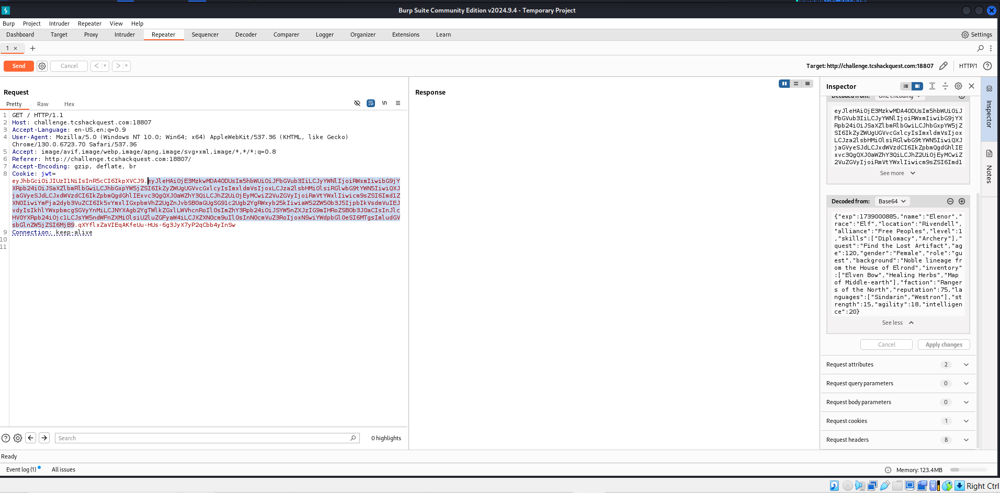
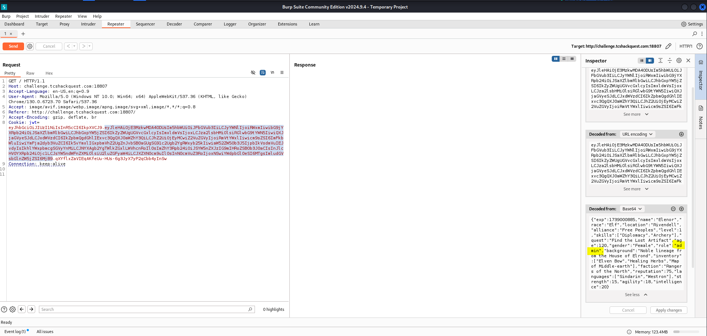
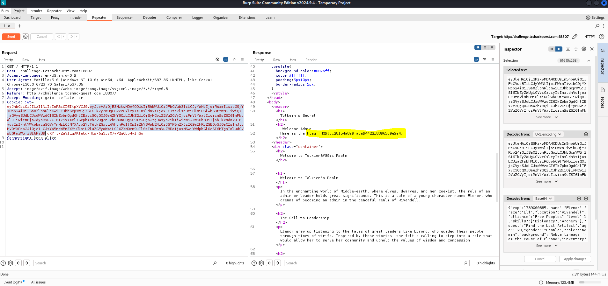
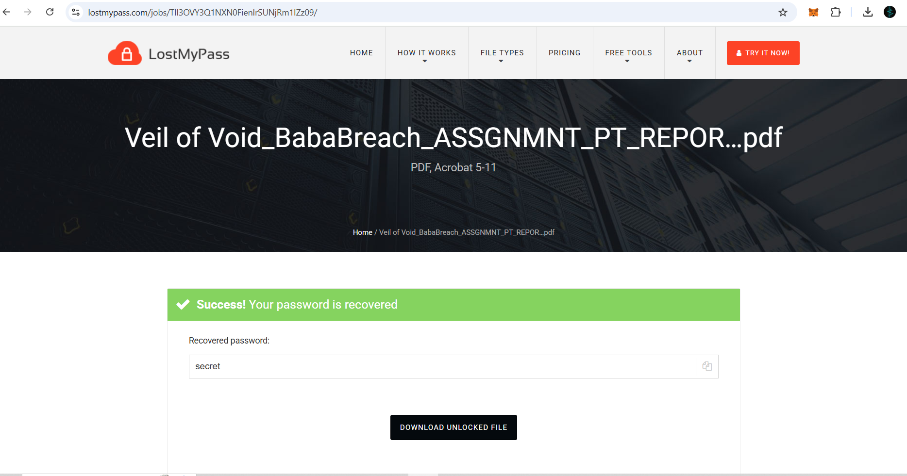
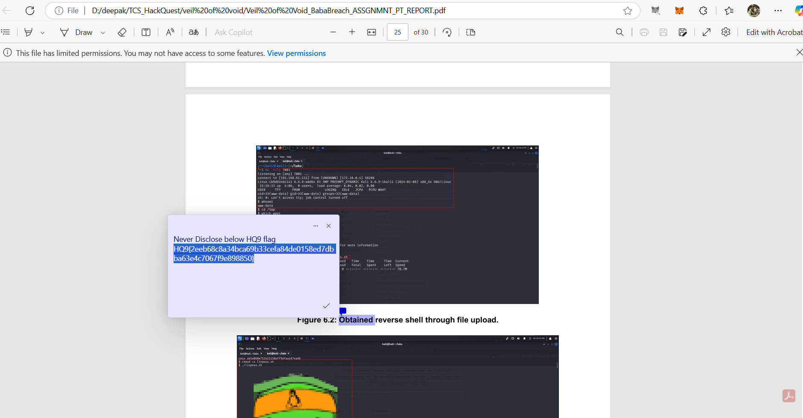

` These write-ups are little-bit based on memory due to time constraints during the event. `

## 1. Shade Wars

Solution :

A PNG file named ` Shade Wars ` is given.

The main objective is to convert only the white background of the image to the black, which can be done by visiting the site <https://onlinepngtools.com/change-png-color> and convert colors.

Then scan the recieved QR code using <https://scanqr.org/> site to get the hidden flag key.

## 2. Tolkien's Secret

Solution :

A website is given, and as the name suggest there is something to do with ` token and cookie `.

So open the site in ` burpsuite `. Reload the site, to create the initial cookies. It seems it is the JSON web token. 

Then take the payload part of the jwt and decode it using base64. there is a ` role ` in token which is initially set to ` guest `, convert it to ` admin `. then send the packet. 

In respone the hidden flag key is visible.

## 3. Veil of Void

Solution :

A PDF named ` Veil of Void_BabaBreach_ASSGNMNT_PT_REPORT ` is given which is locked under a password. upload it to <https://www.lostmypass.com/file-types/pdf/> to crack the pdf and get the password ` secret `.

Then open the pdf using the received password. after thoroughly reading the pdf. there is a highlight at ` page 25 ` which clearly show the hidden flag key.

