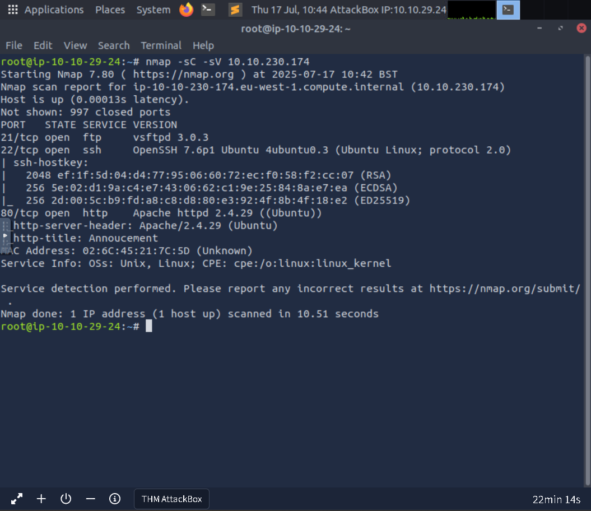

## Brooklyn Nine Nine
**lab link: <https://tryhackme.com/room/brooklynninenine>**

Scanning 

Go to the http link, Open the site through Burp suite, in the "User-agent" header replace default value with "R" as hinted in web page. 

it shows there are 25 members but there is 26 alphabets, so one contain some info, So enumerate through all alphabets, and in C, you get the username...

Then use Hydra to crack ftp password of "Chris"...

Then get all the files from ftp...

the contents are as follows...

Crack the passwords and Unzip the zip file...

Decode the the passphrase and get password...

Then ssh to James, and get the User.txt...

And use "sudo -l" and gtfobin to get the root access, and get the Root.txt...

