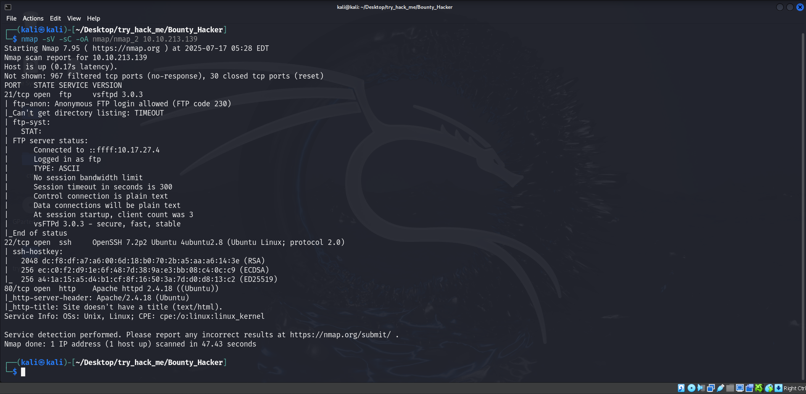
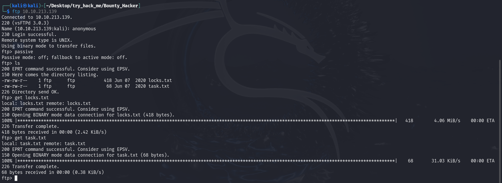
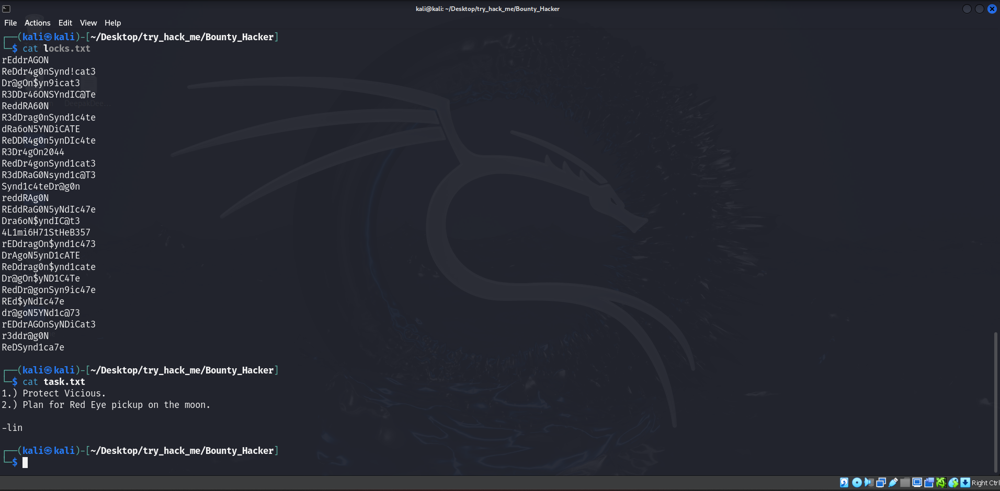
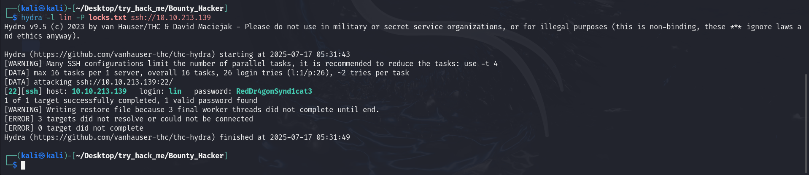
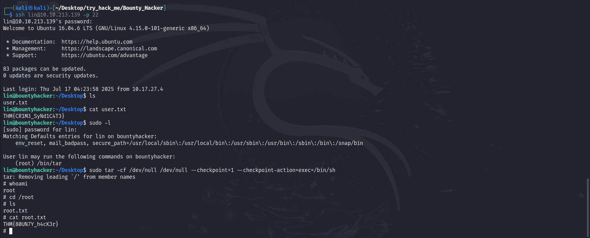

**lab link: <https://tryhackme.com/room/cowboyhacker>**

Scanning :

Login `ftp` with `anonymous` Creds and `get` all the files...

Content of files ...

They contain username and list of passwords, use `hydra` to get the password...

`ssh` the IP using the Creds, and get the `user.txt` and `sudo -l` to privesc and get the `root.txt` ...

