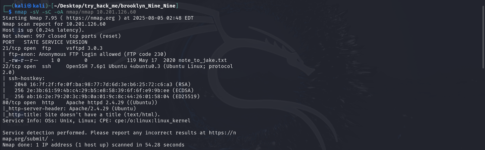

**lab link: <https://tryhackme.com/room/brooklynninenine>**

Scanning 

There is Open FTP port. Try it...

there is `jake` which seems as username. try it with hydra to crack password...

We get the password, ssh the user and get the `user.txt`...

then Use `Sudo -l` , you will see the `less` command , so use `!/sh` as this has `sh`...

You will get the root, traverse to the `root.txt` ...

