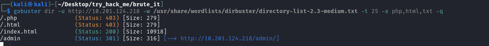
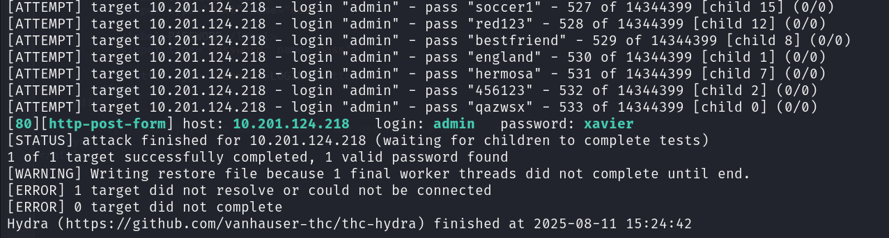
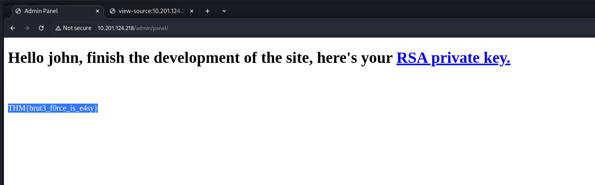

**lab link: <https://tryhackme.com/room/bruteit>**

Scanning 

Gobuster the IP...

Got to site and view source...

Brute force the password using hydra with `rockyou.txt` ...

Use the creds to login, you will get the `web flag` and the `RSA private key`...

Use the `john` to crack the passphrase from key...

Ssh to the `john` and get the `user.txt` ...

Use `sudo -l` and `cat` the `/etc/shadow` file...

Crack the root password using the `john` and `rockyou.txt` ...

Su `root` and get the `root.txt` ...

