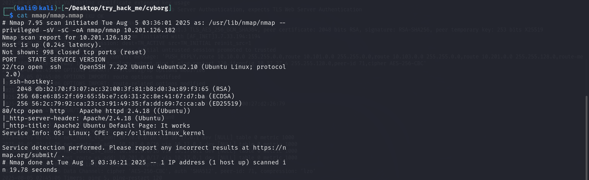
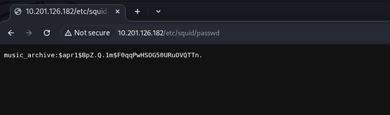
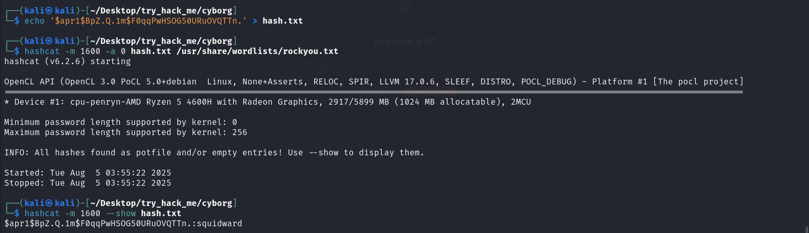
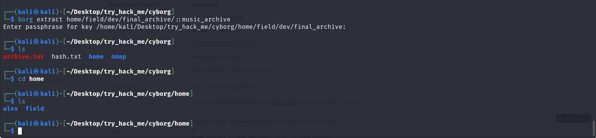
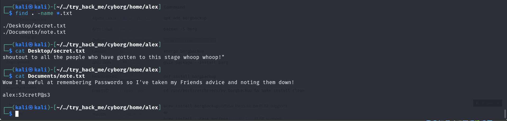
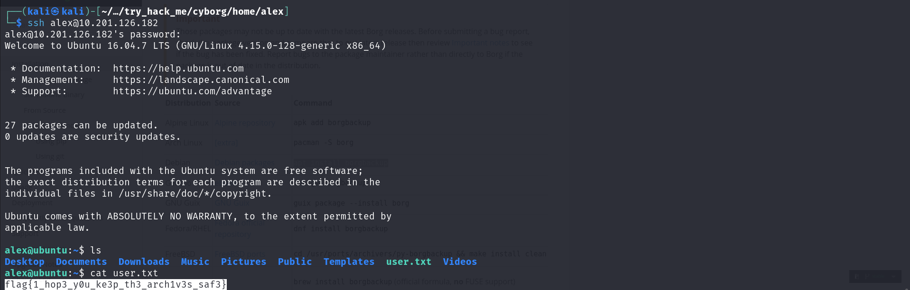
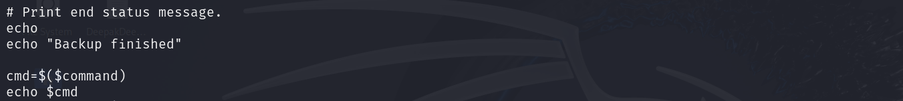
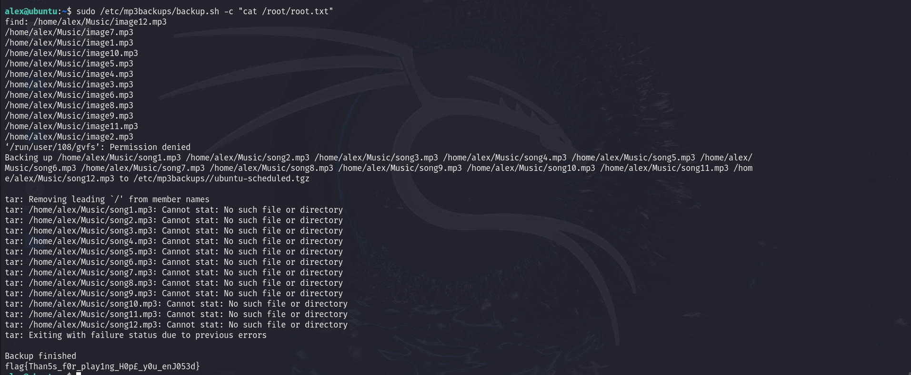

**lab link: <https://tryhackme.com/room/cyborgt8>**

Scanning :

gobuster the site and go to `/etc/squid/passwd` page...

Use `hashcat` with `rockyou.txt` to decrypt password...

Go to `Admin` page and download `Archive.tar`, and try `Borg` to extract `final_archive` ...

And `find` the `.txt` files to get any secret files...

You will find the `ssh` Creds, login to `ssh` and get the `user.txt`...

Use `sudo -l` to find sudo commands...

append payload in `backup.sh` file...

Use `backup.sh` to read the `root.txt`...

