**lab link: <https://tryhackme.com/room/lianyu>**

Scanning :

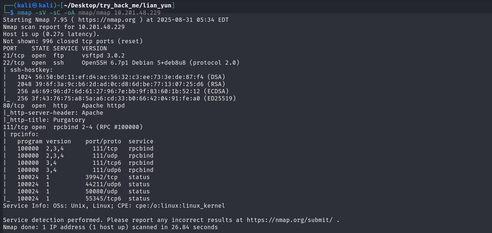

Gobuster the IP...

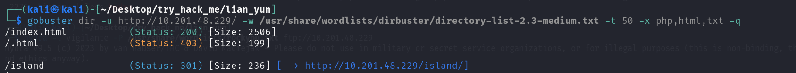

Go to the `island` page ...

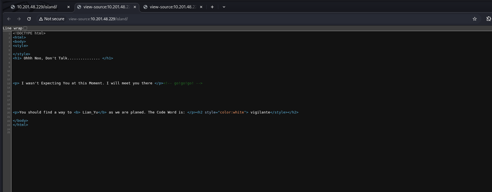

You will get the code word or username, now again gobuster further...

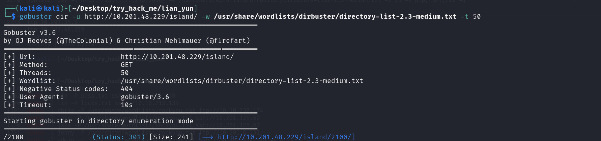

Go to `2100`page, in src it says that our `.ticket` file is available so again gobuster further with `ticket` extention...

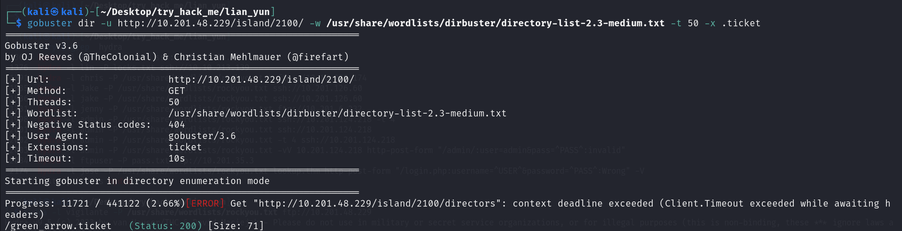

`Wget` the file and `cat` it...

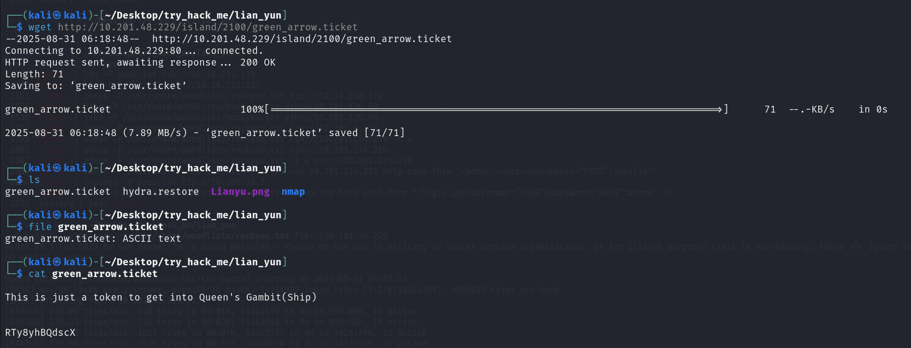

Decode the code...

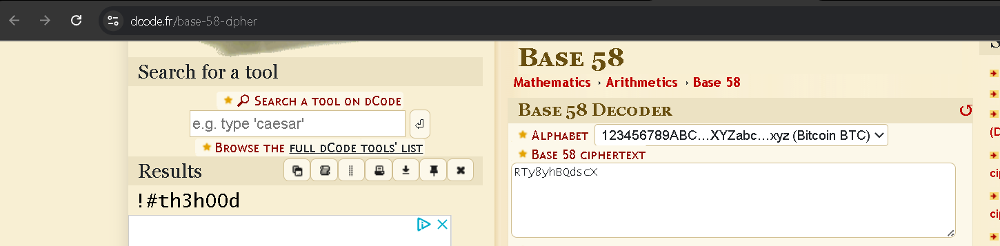

You will get the password, use that to `ftp` the IP and `get` all the files...

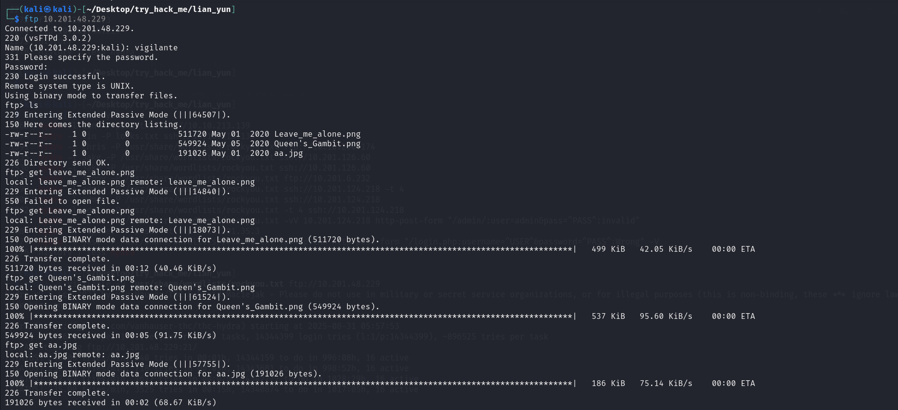

Fix the magic bytes of `Leave_me_alone.png` ...

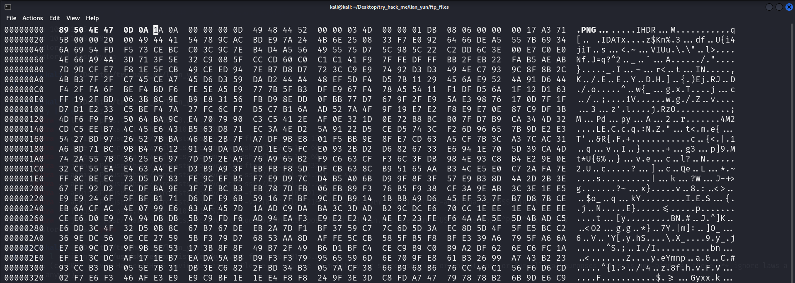

Now open the png, but there is not much...

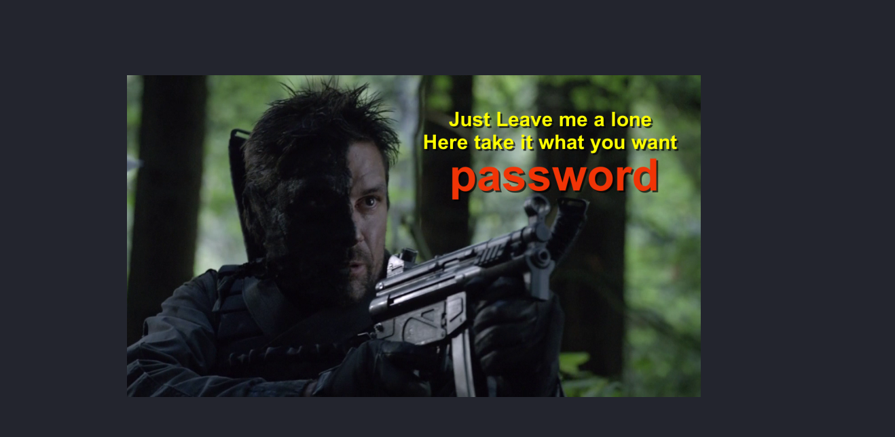

Now try to extract password from the `aa.jpg` using `steghide` ...

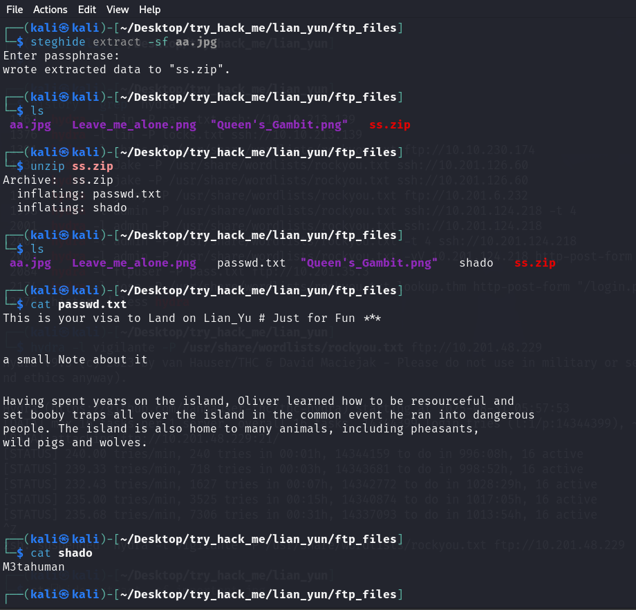

Now you get the password, for username, there is another user while in ftp...

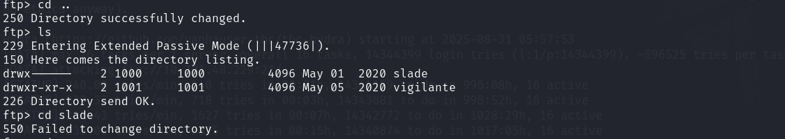

ssh to the IP using the Creds and get `user.txt` ...

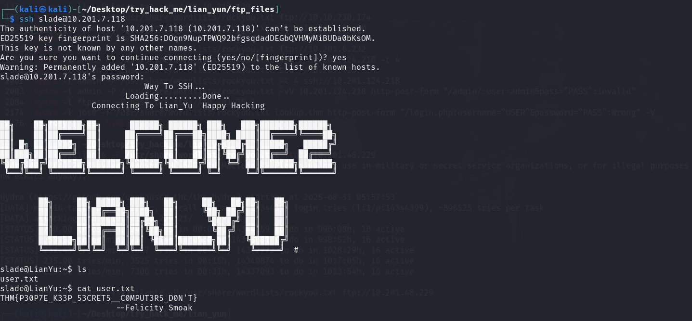

Now `sudo -l` to get sudo commands, and use the privesc payload to become root and get the `root.txt` ...

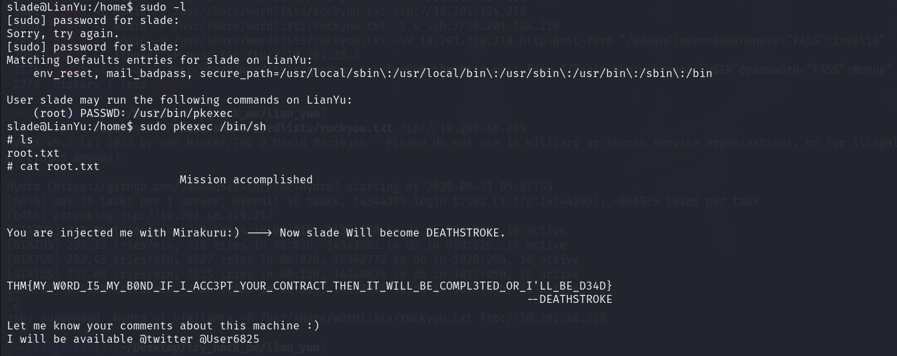