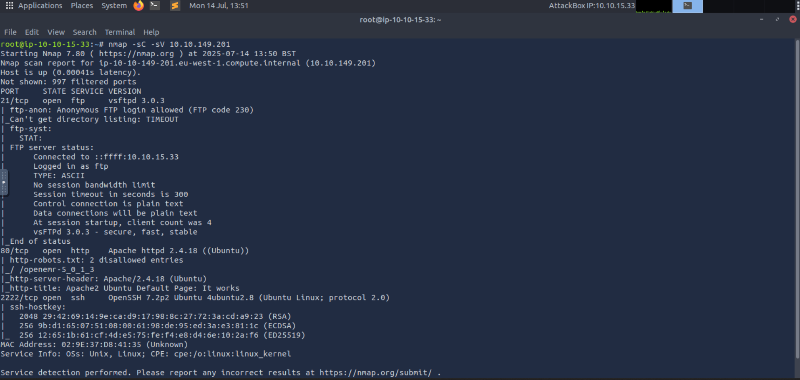
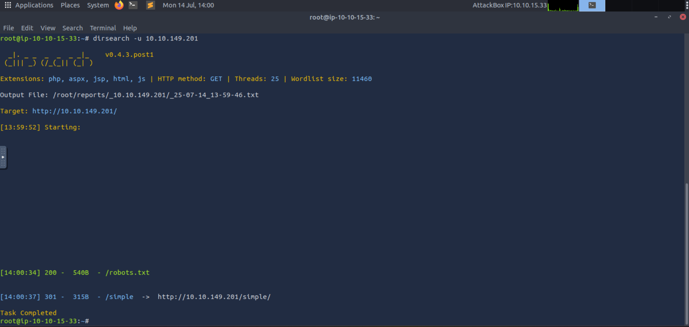
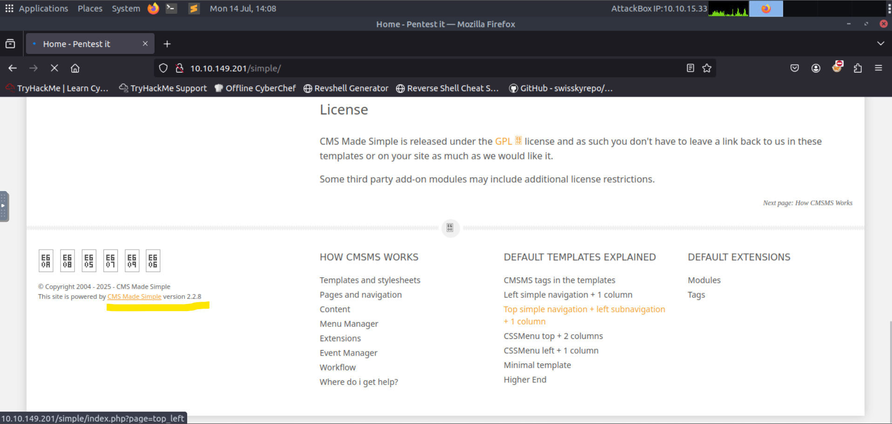
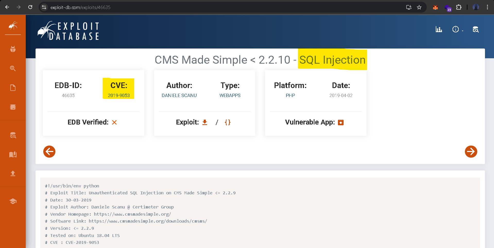
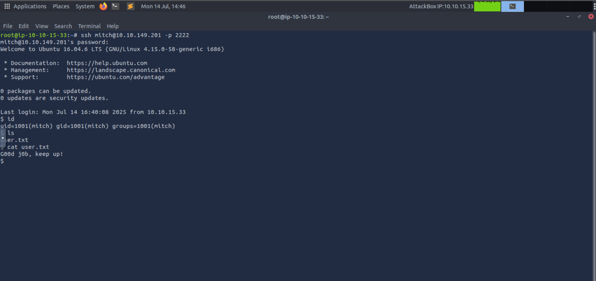
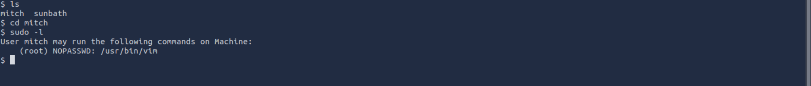
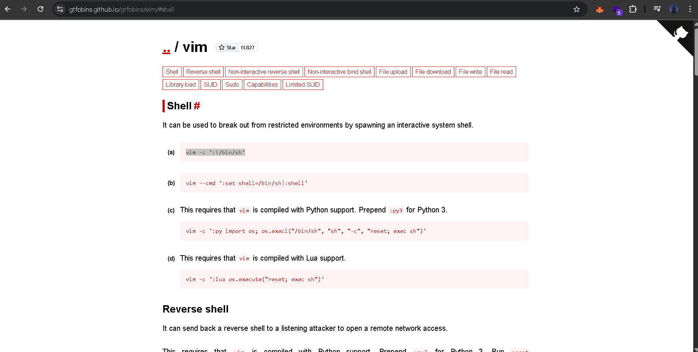
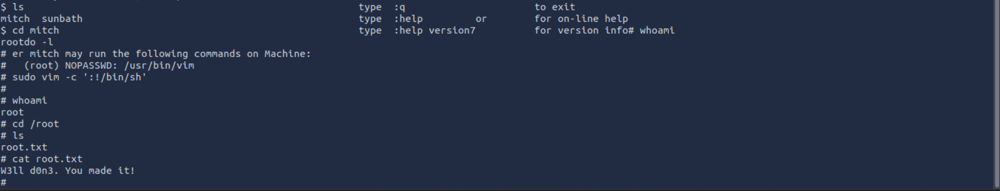

**lab link: <https://tryhackme.com/room/easyctf>**

Scanning :

Directory enumeration the IP...

Go to `simple` page...

There is outdated version of `CMS made simple` used, search for the `CVE` for that...

Use the `CVE` exploit to get the Creds and ssh to the user, and get the `user.txt`...

Now `sudo -l` to get the sudo commands...

Go to `gtfobin` to find the privesc payload for `vim` ...

Get the root, and the `root.txt` ...

