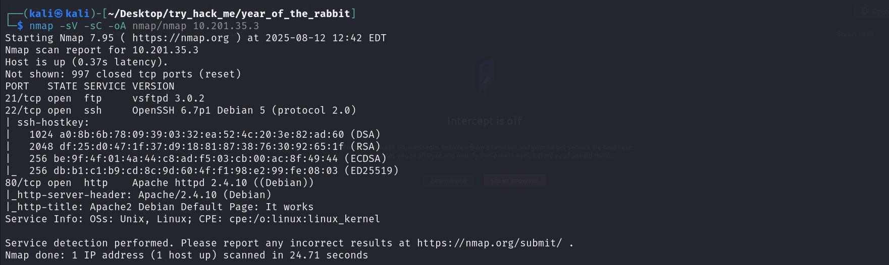

**lab link: <https://tryhackme.com/room/yearoftherabbit>**

Scanning :

Gobuster the site to find the hidden directory, you will find the `/sup3r_s3cr3t_fl4g.php`...

Another hidden page, disable the javascript and go to that page...

there will a png file download it, and there will be username and password list...

Use the hydra to crack the password for `ftpuser`...

Use the Creds to ftp to the ip...

Get the file, which will contain the Brainfuck code, Decode it...

Use the Creds to ssh the ip...

You will find a leet text `s3cr3t`, try find it...

You will get the `gwendonline` password, so Su in it and get the `user.txt`...

Then use `sudo -l` to see the sudo priviledges, and gtfobin it...

and add `:!/bin/bash` at last...

And Voila, you will get the root, so get the `root.txt` ...

